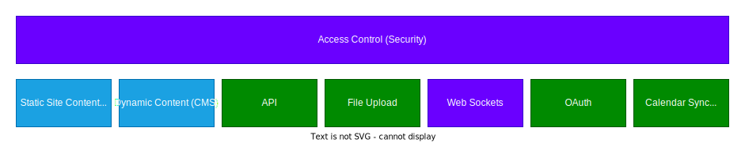

## Gateway Server

The Gateway (Web Server) runs in the DMZ and provides static content and API access

  
  
  
  
  
  
  
  
  

This includes
- Access Control: Whitelisting, Blacklisting and Greylisting (automated temporary black listing) see [Remote IP Address](Remote-IP-Address)
- Session management (including roles)
- Secure access to resources and routes API call to the required services
- API Rate limiting
- API and content caching
- Content Security Policies including script hashing

Everything is API based and stored in memory or Azure Redis (AES encrypted, short term time based expiry). No data is stored on the Gateway Server

Access Control information is cached in memory to enable high load and to protect backend services 

