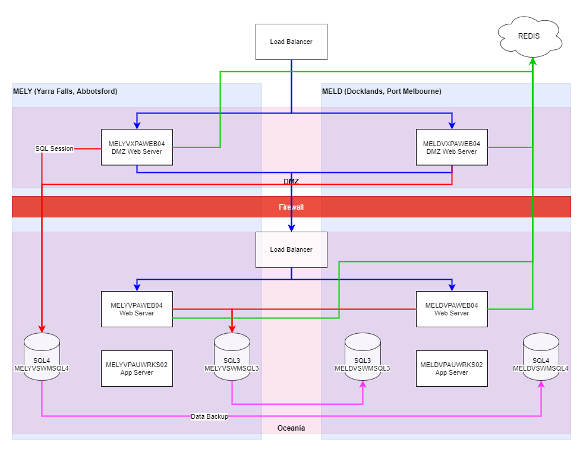

[[_TOC_]]

# Australia

## Web Server Names
||Dev/UAT|Prod Y|Prod D|
|--|--|--|--|
|Oceania Web|MELYVDAUWKWEB04|MELYVPAWEB04|MELDVPAWEB04
|Oceania App|MELYVDAUWK01|MELYVPAUWRKS02|MELDVPAUWRKS02
|DMZ Web|CSOVXCUSHOINET1|MELYVXPAWEB04|MELDVXPAWEB04

## SQL 2019 Server Names
||Dev/UAT|Prod|
|--|--|--|
|Data|CSOVDQSWM50\INS1|CSOVPQCUS02\INS1
|DMZ Session (G2)|CSOVPQCUS03\INS1|CSOVPQCUS03\INS1

-----  
# UK

## Web Server Names
||UAT BRS|UAT NEP|Prod BRS|Prod NEP|
|--|--|--|--|--|
|DMZ Web|BRSPVXOSSWEBUAT|NEPCVXOSSWEBUAT|BRSPVXOSSWEB1|NEPCVXOSSWEB1
|EMEA LAN|BRSPVOSSAPPUAT1|NEPCVOSSAPPUAT1|BRSPVOSSAPP1|NEPCVOSSAPP1

## SQL Server Names
|UAT|Prod|
|--|--|
|db-ccs-oss-uat.emea.cshare.net,65165|db-ccs-oss-prod.emea.cshare.net,65013|

- I think UAT is read/write
- Prod will be read only

